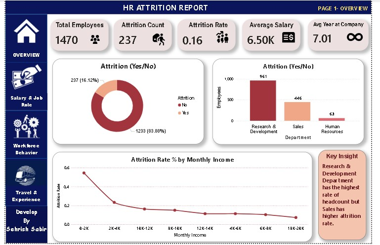
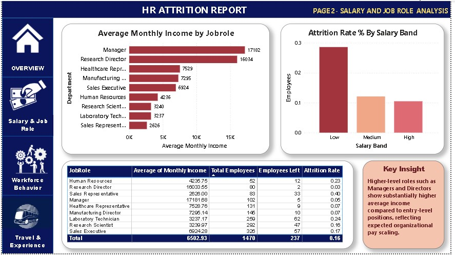
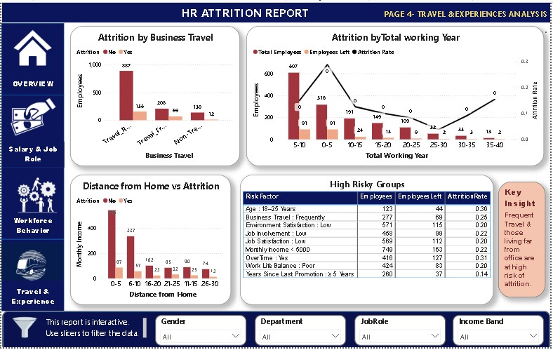
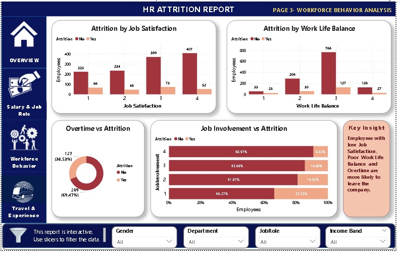

**HR Attrition Insight & Risk Identification Dashboard**

**Project Overview**

This project analyzes employee attrition using SQL and Power BI to identify key factors influencing employee turnover. The dashboard helps HR teams understand attrition trends, monitor workforce behavior, and identify high-risk employee groups for better decision-making.

**Objectives**

Analyze overall employee attrition.
Identify departments with high attrition.
Understand salary and job role impact.
Analyze workforce behavior.
Study travel and experience factors.
Identify high-risk employee groups.
Build an interactive HR dashboard.

**Tools & Technologies**

**Power BI
MySQL
DAX
Power Query
Excel**

**Dataset Information**

Dataset: HR Employee Attrition Dataset

Total Employees: 1470

Employees Left: 237

Overall Attrition Rate: 16.12%

**Dashboard Pages**

**Page 1 – Overview**

KPIs
Total Employees
Attrition Count
Attrition Rate
Average Salary
Average Years at Company

**Dashboard Pages**

**Page 1 – Overview**

KPIs
Total Employees
Attrition Count
Attrition Rate
Average Salary
Average Years at Company
Visuals
Attrition (Yes/No)
Employees by Department
Attrition Rate by Monthly Income
Key Business Insight

**Page 2 – Salary & Job Role Analysis**

Visuals
Average Monthly Income by Job Role
Attrition Rate by Salary Band
Job Role Summary Table
Key Insight
Page 3 – Workforce Behavior Analysis
Visuals
Attrition by Job Satisfaction
Attrition by Work-Life Balance
Overtime vs Attrition
Job Involvement vs Attrition
Key Insight

**Page 4 – Travel & Experience Analysis**

Visuals
Attrition by Business Travel
Attrition by Total Working Years
Distance From Home vs Attrition
High Risk Employee Groups
Key Insight
Key Business Insights
Overall employee attrition rate is 16.12%.
Research & Development department has the highest employee count.
Lower salary bands show higher attrition.
Employees working overtime are more likely to leave.
Poor Job Satisfaction and Work-Life Balance increase attrition.
Frequent business travelers have higher attrition.
Employees with fewer years of experience show higher turnover risk.

**SQL Analysis**

Performed SQL queries to analyze:

Employee Count
Attrition Count
Active Employees
Department Analysis
Salary Analysis
Overtime Analysis
Business Travel Analysis
Job Satisfaction
Work-Life Balance
Years Since Last Promotion
Monthly Income
Distance From Home
High Risk Employee Groups

**Power BI Features**

Interactive Dashboard
Navigation Buttons
Slicers
DAX Measures
KPI Cards
Custom Theme
Business Insights
Dynamic Filtering 

**Project Outcomes**

Built a 4-page interactive HR dashboard.
Identified key attrition drivers.
Improved HR decision-making through data visualization.
Created business-focused insights using SQL and Power BI.
Dashboard Preview

**Overview Dashboard**

**Salary & Job Role Analysis**

**Travel and Experience Analysis**

**Workforce Behavior Analysis**

**Repository Structure**

HR-Attrition-Dashboard/
│
├── Dataset/
│   ├── HR_Analyst_raw.xlsx
    ├── HR_Attrition_Cleaned.csv
│
├── HR_Analysis.sql/
│   ├── Hr_Attrition.sql
│
├── PowerBI/
│   ├── Hr_attrition.pbix
    ├── Icons/
 ├── images/
    ├── Overview.png
│   ├── Salary_JobRole.png
│   ├── Workforce_Behavior.png
│   ├── Travel_Experience.png

├── README.md

**Skills Demonstrated**

SQL
Data Cleaning
Data Analysis
Power BI
DAX
Power Query
Dashboard Design
Business Intelligence
HR Analytics
Data Visualization

**Author**

 **Sehrish Sabir**

**Aspiring Data Analyst**

